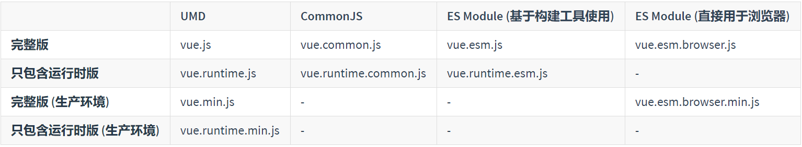
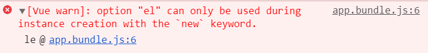
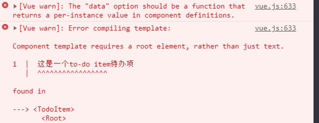

<div style="text-align:center;">
    <h2>
        Vue 学习笔记
    </h2>
    
</div>


## 基础

### 安装

#### Vue DevTool插件安装

在浏览器上安装 [Vue Devtools](https://github.com/vuejs/vue-devtools#vue-devtools)。它允许你在一个更友好的界面中审查和调试 Vue 应用。

#### 对不同构建版本的解释

 npm包的`dist`目录中能发现很多`Vue.js `构建版本。

```
dist
|-- README.md
|-- vue.common.dev.js
|-- vue.common.js
|-- vue.common.prod.js
|-- vue.esm.browser.js
|-- vue.esm.browser.min.js
|-- vue.esm.js
|-- vue.js
|-- vue.min.js
|-- vue.runtime.common.dev.js
|-- vue.runtime.common.js
|-- vue.runtime.common.prod.js
|-- vue.runtime.esm.js
|-- vue.runtime.js
`-- vue.runtime.min.js
```

<div style="text-align:center;">
    
</div>


- **完整版**：同时包含编译器和运行时的版本。
- **编译器**：用来将模板字符串编译成为 JavaScript 渲染函数的代码。
- **运行时**：用来创建 Vue 实例、渲染并处理虚拟 DOM 等的代码。基本上就是除去编译器的其它一切。
- **[UMD(Universal Module Definition)](https://github.com/umdjs/umd)**：UMD 版本可以通过 `<script>` 标签直接用在浏览器中。
- **[CommonJS](http://wiki.commonjs.org/wiki/Modules/1.1)**：CommonJS 版本用来配合老的打包工具比如 [Browserify](http://browserify.org/) 或 [webpack 1](https://webpack.github.io/)。这些打包工具的默认文件 (`pkg.main`) 是只包含运行时的 CommonJS 版本 (`vue.runtime.common.js`)。
- **[ES Module](http://exploringjs.com/es6/ch_modules.html)**：从 2.6 开始 Vue 会提供两个 ES Modules (ESM) 构建文件：
  - 为打包工具提供的 ESM：为诸如 [webpack 2](https://webpack.js.org/) 或 [Rollup](https://rollupjs.org/) 提供的现代打包工具。ESM 格式被设计为可以被静态分析，所以打包工具可以利用这一点来进行“tree-shaking”并将用不到的代码排除出最终的包。为这些打包工具提供的默认文件 (`pkg.module`) 是只有运行时的 ES Module 构建 (`vue.runtime.esm.js`)。
  - 为浏览器提供的 ESM (2.6+)：用于在现代浏览器中通过 `<script type="module">` 直接导入。

##### 运行时+编译器 vs 只包含运行时

如果你需要在客户端编译模板 (比如传入一个字符串给 `template` 选项，或挂载到一个元素上并以其 DOM 内部的 HTML 作为模板)，就将需要加上编译器，即完整版：

```vue
// 需要编译器
new Vue({
  template: '<div>{{ hi }}</div>'
})

// 不需要编译器
new Vue({
  render (h) {
    return h('div', this.hi)
  }
})
```

当使用 `vue-loader` 或 `vueify` 的时候，`*.vue` 文件内部的模板会在构建时预编译成 JavaScript。你在最终打好的包里实际上是不需要编译器的，所以只用运行时版本即可。

> webpack打包默认使用的是 `vue.runtime.esm.js`

因为运行时版本相比完整版体积要小大约 30%，所以应该尽可能使用这个版本。如果你仍然希望使用完整版，则需要在打包工具里配置一个别名：

**webpack**

```js
module.exports = {
  // ...
  resolve: {
    alias: {
      'vue$': 'vue/dist/vue.esm.js' // 用 webpack 1 时需用 'vue/dist/vue.common.js'
    }
  }
}
```

##### 开发环境vs生产环境

对于 UMD 版本来说，开发环境/生产环境模式是硬编码好的：开发环境下用未压缩的代码，生产环境下使用压缩后的代码。

CommonJS 和 ES Module 版本是用于打包工具的，因此我们不提供压缩后的版本。你需要自行将最终的包进行压缩。

CommonJS 和 ES Module 版本同时保留原始的 `process.env.NODE_ENV` 检测，以决定它们应该运行在什么模式下。你应该使用适当的打包工具配置来替换这些环境变量以便控制 Vue 所运行的模式。把 `process.env.NODE_ENV` 替换为字符串字面量同时可以让 UglifyJS 之类的压缩工具完全丢掉仅供开发环境的代码块，以减少最终的文件尺寸。

###### webpack

在 webpack 4+ 中，你可以使用 `mode` 选项：

```
module.exports = {
  mode: 'production'
}
```

但是在 webpack 3 及其更低版本中，你需要使用 [DefinePlugin](https://webpack.js.org/plugins/define-plugin/)：

```
var webpack = require('webpack')

module.exports = {
  // ...
  plugins: [
    // ...
    new webpack.DefinePlugin({
      'process.env': {
        NODE_ENV: JSON.stringify('production')
      }
    })
  ]
}
```

##### CSP环境

有些环境，如 Google Chrome Apps，会强制应用内容安全策略 (CSP)，不能使用 `new Function()` 对表达式求值。这时可以用 CSP 兼容版本。完整版本依赖于该功能来编译模板，所以无法在这些环境下使用。

另一方面，运行时版本则是完全兼容 CSP 的。当通过 [webpack + vue-loader](https://github.com/vuejs-templates/webpack-simple) 或者 [Browserify + vueify](https://github.com/vuejs-templates/browserify-simple) 构建时，模板将被预编译为 `render` 函数，可以在 CSP 环境中完美运行。

### 组件和Vue实例

组件系统是 Vue 的另一个重要概念，因为它是一种抽象，允许我们使用小型、独立和通常可复用的组件构建大型应用。仔细想想，几乎任意类型的应用界面都可以抽象为一个组件树：


#### 注册组件

在 Vue 里，一个组件本质上是一个拥有预定义选项的一个 Vue 实例。在 Vue 中注册组件很简单：

```vue
Vue.component( 'todo-item',{
    // el: "#todo",
    template: '<li>这是一个to-do item待办项</li>',
    data: {
        message: '这是一个to-do item待办项'
    }
})
```

> 注意点：
>
> 1. 普通组件是不能有`el`属性的，因为只要通过`new Vue(...)`创建的实例才能拥有`el`属性。
>
>    
>
> 2. `template`必须包含一个根元素的
>
>    

#### 使用`props`传参

```js
const Vue = require('vue');

Vue.component( 'todo-item',{
    // el: "#todo",
    template: `
    <div>
        {{context}}
        <p>截止时间:{{date}}</p>
    </div>
    `,
    data: {
        message1: '这是一个to-do item待办项'
    },
    props: {
        'context': {
            type: String,
            default: ""
        },
        "date": {
            type: String,
            default: new Date().toLocaleDateString()
        }
    }
})
```

> props接受两种形式：
>
> 1. 数组
>
>    ```js
>    props: ['context','date']
>    ```
>
> 2. 对象
>
>    ```js
>    props: {
>            'context': {
>                type: String,
>                default: ""
>            },
>            "date": {
>                type: String,
>                default: new Date().toLocaleDateString()
>            }
>        }
>    ```

#### Vue组件 和自定义元素的关系

你可能已经注意到 Vue 组件非常类似于**自定义元素**——它是 [Web 组件规范](https://www.w3.org/wiki/WebComponents/)的一部分，这是因为 Vue 的组件语法部分参考了该规范。例如 Vue 组件实现了 [Slot API](https://github.com/w3c/webcomponents/blob/gh-pages/proposals/Slots-Proposal.md) 与 `is` attribute。但是，还是有几个关键差别：

1. Web Components 规范已经完成并通过，但未被所有浏览器原生实现。目前 Safari 10.1+、Chrome 54+ 和 Firefox 63+ 原生支持 Web Components。相比之下，Vue 组件不需要任何 polyfill，并且在所有支持的浏览器 (IE9 及更高版本) 之下表现一致。必要时，Vue 组件也可以包装于原生自定义元素之内。
2. Vue 组件提供了纯自定义元素所不具备的一些重要功能，最突出的是跨组件数据流、自定义事件通信以及构建工具集成。

虽然 Vue 内部没有使用自定义元素，不过在应用使用自定义元素、或以自定义元素形式发布时，[依然有很好的互操作性](https://custom-elements-everywhere.com/#vue)。Vue CLI 也支持将 Vue 组件构建成为原生的自定义元素。

> 关键词：`自定义元素`

### Vue实例

#### 创建一个实例

每个 Vue 应用都是通过用 `Vue` 函数创建一个新的 **Vue 实例**开始的：

```js
var vm = new Vue({
  // 选项
})
```

虽然没有完全遵循 [MVVM 模型](https://zh.wikipedia.org/wiki/MVVM)，但是 Vue 的设计也受到了它的启发。因此在文档中经常会使用 `vm`(ViewModel 的缩写) 这个变量名表示 Vue 实例。

视图模型(viewModel)的行为由传入的**选项对象**定义。可以在 [API 文档](https://cn.vuejs.org/v2/api/#选项-数据) 中浏览完整的选项列表。

一个 Vue 应用由一个通过 `new Vue` 创建的**根 Vue 实例**，以及可选的嵌套的、可复用的组件树组成。举个例子，一个 todo 应用的组件树可以是这样的：

```
根实例
└─ TodoList
   ├─ TodoItem
   │  ├─ DeleteTodoButton
   │  └─ EditTodoButton
   └─ TodoListFooter
      ├─ ClearTodosButton
      └─ TodoListStatistics
```

所有的组件也是Vue实例，并且接受相同的选项对象，一些根实例特有的选项除外（例如前文讲到的`el`属性）。

#### 数据和方法

当一个 Vue 实例被创建时，它将 `data` 对象中的所有的属性加入到 Vue 的**响应式系统**中。当这些属性的值发生改变时，视图将会产生“响应”，即匹配更新为新的值。

```js
// 我们的数据对象
var data = { a: 1 }

// 该对象被加入到一个 Vue 实例中
var vm = new Vue({
  data: data
})

// 获得这个实例上的属性
// 返回源数据中对应的字段
vm.a == data.a // => true

// 设置属性也会影响到原始数据
vm.a = 2
data.a // => 2

// ……反之亦然
data.a = 3
vm.a // => 3
```

> 对象类型的data属性只能作为`根Vue实例`的选项，组件实例的`data`选项只能是函数。

当这些数据改变时，视图会进行重渲染。值得注意的是只有当实例被创建时就已经存在于 `data` 中的属性才是**响应式**的。也就是说如果你添加一个新的属性，比如：

```js
vm.b = 'hi'
```

那么对 `b` 的改动将不会触发任何视图的更新。如果你知道你会在晚些时候需要一个属性，但是一开始它为空或不存在，那么你仅需要设置一些初始值。比如：

```json
data: {
  newTodoText: '',
  visitCount: 0,
  hideCompletedTodos: false,
  todos: [],
  error: null
}
```

<div>
  <iframe height="265" style="width: 100%;" scrolling="no" title="vue-helloworld" src="https://codepen.io/zjlyyq/embed/ZEGVWLx?height=265&theme-id=light&default-tab=js,result" frameborder="no" allowtransparency="true" allowfullscreen="true">
  See the Pen <a href='https://codepen.io/zjlyyq/pen/ZEGVWLx'>vue-helloworld</a> by Zhang Jialu
  (<a href='https://codepen.io/zjlyyq'>@zjlyyq</a>) on <a href='https://codepen.io'>CodePen</a>.
</iframe>
</div>


这里唯一的例外是使用 `Object.freeze()`，这会阻止修改现有的属性，也意味着响应系统无法再*追踪*变化。

除了数据属性，Vue 实例还暴露了一些有用的实例属性与方法。它们都有前缀 `$`，以便与用户定义的属性区分开来。例如：

```js
var data = { a: 1 }
var vm = new Vue({
  el: '#example',
  data: data
})

vm.$data === data // => true
vm.$el === document.getElementById('example') // => true

// $watch 是一个实例方法
vm.$watch('a', function (newValue, oldValue) {
  // 这个回调将在 `vm.a` 改变后调用
})
```

#### 实例生命周期钩子

每个 Vue 实例在被创建时都要经过一系列的初始化过程——例如，需要设置数据监听、编译模板、将实例挂载到 DOM 并在数据变化时更新 DOM 等。同时在这个过程中也会运行一些叫做**生命周期钩子**的函数，这给了用户在不同阶段添加自己的代码的机会。

比如 [`created`](https://cn.vuejs.org/v2/api/#created) 钩子可以用来在一个实例被创建之后执行代码：

```js
new Vue({
  data: {
    a: 1
  },
  created: function () {
    // `this` 指向 vm 实例
    console.log('a is: ' + this.a)
  }
})
// => "a is: 1"
```

也有一些其它的钩子，在实例生命周期的不同阶段被调用，如 [`mounted`](https://cn.vuejs.org/v2/api/#mounted)、[`updated`](https://cn.vuejs.org/v2/api/#updated) 和 [`destroyed`](https://cn.vuejs.org/v2/api/#destroyed)。生命周期钩子的 `this` 上下文指向调用它的 Vue 实例。

> 不要在选项属性或回调上使用[箭头函数](https://developer.mozilla.org/zh-CN/docs/Web/JavaScript/Reference/Functions/Arrow_functions)，比如 `created: () => console.log(this.a)`或 `vm.$watch('a', newValue => this.myMethod())`。因为箭头函数并没有 `this`，`this` 会作为变量一直向上级词法作用域查找，直至找到为止，经常导致 `Uncaught TypeError: Cannot read property of undefined` 或 `Uncaught TypeError: this.myMethod is not a function` 之类的错误。

#### 生命周期图示

<div style="text-align:center;">
    
</div>


### 模板语法

Vue.js 使用了基于 HTML 的模板语法，允许开发者声明式地将 DOM 绑定至底层 Vue 实例的数据。所有 Vue.js 的模板都是合法的 HTML，所以能被遵循规范的浏览器和 HTML 解析器解析。

> 从根元素内部开始，所有的语法就都是模板范畴了，都适用于模板语法。

在底层的实现上，Vue 将模板编译成虚拟 DOM 渲染函数。结合响应系统，Vue 能够智能地计算出最少需要重新渲染多少组件，并把 DOM 操作次数减到最少。

如果你熟悉虚拟 DOM 并且偏爱 JavaScript 的原始力量，你也可以不用模板，[直接写渲染 (render) 函数](https://cn.vuejs.org/v2/guide/render-function.html)，使用可选的 JSX 语法。

#### 插值

##### 文本

1. Mustache 语法:双大括号`{{}}`
2. `v-once`

##### 原始HTML

`v-html`

##### HTML attribute

ustache 语法不能作用在 HTML attribute 上，遇到这种情况应该使用 [`v-bind` 指令](https://cn.vuejs.org/v2/api/#v-bind)：

`v-bind`

```html
<button v-bind:class="btPrimaryClass">
  取消
</button>
<button v-bind:class="!submitFlag?'btn':btPrimaryClass">
  提交
</button>
```

<div>
  <iframe height="265" style="width: 100%;" scrolling="no" title="vue模板语法" src="https://codepen.io/zjlyyq/embed/WNvLgjV?height=265&theme-id=light&default-tab=html,result" frameborder="no" allowtransparency="true" allowfullscreen="true">
  See the Pen <a href='https://codepen.io/zjlyyq/pen/WNvLgjV'>vue模板语法</a> by Zhang Jialu
  (<a href='https://codepen.io/zjlyyq'>@zjlyyq</a>) on <a href='https://codepen.io'>CodePen</a>.
</iframe>
</div>


##### 使用 JavaScript 表达式

迄今为止，在我们的模板中，我们一直都只绑定简单的属性键值。但实际上，对于所有的数据绑定，Vue.js 都提供了完全的 JavaScript 表达式支持。

```html
{{ number + 1 }}

{{ ok ? 'YES' : 'NO' }}

{{ message.split('').reverse().join('') }}

<div v-bind:id="'list-' + id"></div>
```

#### 指令

指令是指带有前缀 `v-` 的 `attribute` ，值预期是**单个的JavaScript表达式**（`v-for`是个例外）。指令的作用是，当表达式的值发生变化时，将其产生的连带影响，响应式地作用于 DOM。

例如：

```html
<p v-if="seen">现在你看到我了</p>
```

这里，`v-if` 指令将根据表达式 `seen` 的值的真假来插入/移除 `p` 元素。

##### 参数

一些指令能够接收一个“参数”，在指令名称之后以冒号表示。例如，`v-bind` 指令可以用于响应式地更新 HTML attribute：

```html
<a v-bind:href="url">...</a>
<button v-bind:class="!submitFlag?'btn':btPrimaryClass">
  提交
</button>
```

在这里 `href` 是参数，告知 `v-bind` 指令将该元素的 `href` attribute 与表达式 `url` 的值绑定。

另一个指令是`v-on`，它用于监听 DOM 事件：

```html
<a v-on:click="doSomething">...</a>
```

##### 动态参数

> 2.6.0 新增

从 2.6.0 开始，可以用方括号括起来的 JavaScript 表达式作为一个指令的参数：

```html
<!--
注意，参数表达式的写法存在一些约束，如之后的“对动态参数表达式的约束”章节所述。
-->
<a v-bind:[attributeName]="url"> ... </a>
```

这里的 `attributeName` 会被作为一个 JavaScript 表达式进行动态求值，求得的值将会作为最终的参数来使用。例如，如果你的 Vue 实例有一个 `data` 属性 `attributeName`，其值为 `"href"`，那么这个绑定将等价于 `v-bind:href`。

同样地，你可以使用动态参数为一个动态的事件名绑定处理函数：

```html
<a v-on:[eventName]="doSomething"> ... </a>
```

在这个示例中，当 `eventName` 的值为 `"focus"` 时，`v-on:[eventName]` 将等价于 `v-on:focus`。

###### 对动态参数的值的约束

动态参数预期会求出一个字符串，异常情况下值为 `null`。这个特殊的 `null` 值可以被显性地用于移除绑定。任何其它非字符串类型的值都将会触发一个警告。

###### 对动态参数表达式的约束

动态参数表达式有一些语法约束，因为某些字符，如空格和引号，放在 HTML attribute 名里是无效的。例如：

```html
<!-- 这会触发一个编译警告 -->
<a v-bind:['foo' + bar]="value"> ... </a>
```

变通的办法是使用没有空格或引号的表达式，或用计算属性替代这种复杂表达式。

在 DOM 中使用模板时 (直接在一个 HTML 文件里撰写模板)，还需要避免使用大写字符来命名键名，因为浏览器会把 attribute 名全部强制转为小写：

```html
<!--
在 DOM 中使用模板时这段代码会被转换为 `v-bind:[someattr]`。
除非在实例中有一个名为“someattr”的 property，否则代码不会工作。
-->
<a v-bind:[someAttr]="value"> ... </a>
```

##### 修饰符

```html
<form v-on:submit.prevent="onSubmit">...</form>
```

#### 缩写

`v-bind` = `:`

`v-on `=`@`

### 计算属性和侦听器

#### 计算属性

对于任何复杂逻辑，你都应当使用**计算属性**。

##### 基础例子

```html
<div id="example">
  <p>Original message: "{{ message }}"</p>
  <p>Computed reversed message: "{{ reversedMessage }}"</p>
</div>
```

```js
var vm = new Vue({
  el: '#example',
  data: {
    message: 'Hello'
  },
  computed: {
    // 计算属性的 getter
    reversedMessage: function () {
      // `this` 指向 vm 实例
      return this.message.split('').reverse().join('')
    }
  }
})
```

这里声明了一个计算属性 `reversedMessage`。提供的函数将用作属性 `vm.reversedMessage` 的 getter 函数：

你可以像绑定普通属性一样在模板中绑定计算属性。Vue 知道 `vm.reversedMessage` 依赖于 `vm.message`，因此当 `vm.message` 发生改变时，所有依赖 `vm.reversedMessage` 的绑定也会更新。而且最妙的是我们已经以声明的方式创建了这种依赖关系：计算属性的 getter 函数是没有副作用 (side effect) 的，这使它更易于测试和理解。

##### 计算属性 vs 方法

可以用方法实现计算属性的效果：

```html
<p>Original message: {{ message }}</p>
<p>Computed reversed message: {{ reversedMessage }}</p>
<p>Computed reversed messagetion by Func: {{ reversedMessageFunc() }}</p>
```

```js
methods: {
  reversedMessageFunc() {
    return this.message.split(' ').reverse().join('');
  }
},
```

我们可以将同一函数定义为一个方法而不是一个计算属性。两种方式的最终结果确实是完全相同的。然而，不同的是**计算属性是基于它们的响应式依赖进行缓存的**。只在相关响应式依赖发生改变时它们才会重新求值。这就意味着只要 `message` 还没有发生改变，多次访问 `reversedMessage`计算属性会立即返回之前的计算结果，而不必再次执行函数。

这也同样意味着下面的计算属性将不再更新，因为 `Date.now()` 不是响应式依赖：

```js
computed: {
  now: function () {
    return Date.now()
  }
}
```

相比之下，每当触发重新渲染时，调用方法将**总会**再次执行函数。

> 关于这里，我其实不是特别理解。出发重新渲染说明`data`有改变，计算属性应该也是要重新计算的，这和方法的效果不是一样吗？

我们为什么需要缓存？假设我们有一个性能开销比较大的计算属性 **A**，它需要遍历一个巨大的数组并做大量的计算。然后我们可能有其他的计算属性依赖于 **A**。如果没有缓存，我们将不可避免的多次执行 **A** 的 getter！如果你不希望有缓存，请用方法来替代。

##### 计算属性 VS 侦听属性

Vue 提供了一种更通用的方式来观察和响应 Vue 实例上的数据变动：**侦听属性**。当你有一些数据需要随着其它数据变动而变动时，你很容易滥用 `watch`——特别是如果你之前使用过 AngularJS。然而，通常更好的做法是使用计算属性而不是命令式的 `watch` 回调。细想一下这个例子：

```html
<div id="demo">{{ fullName }}</div>
```

```js
var vm = new Vue({
  el: '#demo',
  data: {
    firstName: 'Foo',
    lastName: 'Bar',
    fullName: 'Foo Bar'
  },
  watch: {
    firstName: function (val) {
      this.fullName = val + ' ' + this.lastName
    },
    lastName: function (val) {
      this.fullName = this.firstName + ' ' + val
    }
  }
})
```

上面代码是命令式且重复的。将它与计算属性的版本进行比较：

```js
var vm = new Vue({
  el: '#demo',
  data: {
    firstName: 'Foo',
    lastName: 'Bar'
  },
  computed: {
    fullName: function () {
      return this.firstName + ' ' + this.lastName
    }
  }
})
```

好得多了，不是吗？

> 侦听属性(watch)不该被用在简单的返回值上，应该是需要执行复杂动作的时候才用到，否则应该考虑用计算属性。

##### 计算属性的setter

计算属性默认只有 getter，不过在需要时你也可以提供一个 setter：

```js
// ...
computed: {
  fullName: {
    // getter
    get: function () {
      return this.firstName + ' ' + this.lastName
    },
    // setter
    set: function (newValue) {
      var names = newValue.split(' ')
      this.firstName = names[0]
      this.lastName = names[names.length - 1]
    }
  }
}
// ...
```

现在再运行 `vm.fullName = 'John Doe'` 时，setter 会被调用，`vm.firstName` 和 `vm.lastName` 也会相应地被更新。

#### 侦听器

虽然计算属性在大多数情况下更合适，但有时也需要一个自定义的侦听器。这就是为什么 Vue 通过 `watch` 选项提供了一个更通用的方法，来响应数据的变化。当需要在数据变化时执行异步或开销较大的操作时，这个方式是最有用的。


### 条件渲染

`v-if` 指令用于条件性地渲染一块内容。这块内容只会在指令的表达式返回 truthy 值的时候被渲染。

```html
<h1 v-if="awesome">Vue is awesome!</h1>
```

也可以用 `v-else` 添加一个“else 块”：

```html
<h1 v-if="awesome">Vue is awesome!</h1>
<h1 v-else>Oh no 😢</h1>
```

#### 在 `template` 元素上使用 `v-if` 条件渲染分组

因为`v-if`是一个指令，所以必须将它作用在一个元素上。但是如果想切换多个元素，此时可以将一个`<template>` 元素当做不可见的元素，并在上面使用`v-if`。最终渲染结果将不包含`<template>` 元素。

```html
<template v-if="ok">
  <h1>Title</h1>
  <p>Paragraph 1</p>
  <p>Paragraph 2</p>
</template>
```

<div>
    <iframe height="265" style="width: 100%;" scrolling="no" title="v-if-in-template" src="https://codepen.io/zjlyyq/embed/LYVMKeN?height=265&theme-id=light&default-tab=html,result" frameborder="no" allowtransparency="true" allowfullscreen="true">
  See the Pen <a href='https://codepen.io/zjlyyq/pen/LYVMKeN'>v-if-in-template</a> by Zhang Jialu
  (<a href='https://codepen.io/zjlyyq'>@zjlyyq</a>) on <a href='https://codepen.io'>CodePen</a>.
</iframe>
</div>

#### `v-else`

你可以使用`v-else` 指令来表示`v-if`的else块:

```html
<div v-if="Math.random() > 0.5">
  Now you see me
</div>
<div v-else>
  Now you don't
</div>
```

`v-else` 元素必须紧跟在带 `v-if` 或者 `v-else-if` 的元素的后面，否则它将不会被识别。

#### `v-else-if`

> v2.1.0新增

`v-else-if`，顾名思义，充当 `v-if` 的“else-if 块”，可以连续使用：

```html
<div v-if="type === 'A'">
  A
</div>
<div v-else-if="type === 'B'">
  B
</div>
<div v-else-if="type === 'C'">
  C
</div>
<div v-else>
  Not A/B/C
</div>
```

类似于 `v-else`，`v-else-if` 也必须紧跟在带 `v-if` 或者 `v-else-if` 的元素之后。

#### 用`key` 管理可复用的元素

Vue 会尽可能高效地渲染元素，通常会复用已有元素而不是从头开始渲染。这么做除了使 Vue 变得非常快之外，还有其它一些好处。例如，如果你允许用户在不同的登录方式之间切换：

```html
<template v-if="loginType === 'username'">
  <label>Username</label>
  <input placeholder="Enter your username">
</template>
<template v-else>
  <label>Email</label>
  <input placeholder="Enter your email address">
</template>
```

那么在上面的代码中切换 `loginType` 将不会清除用户已经输入的内容。因为两个模板使用了相同的元素，`input` 不会被替换掉——仅仅是替换了它的 `placeholder`。

这样也不总是符合实际需求，所以 Vue 为你提供了一种方式来表达“这两个元素是完全独立的，不要复用它们”。只需添加一个具有唯一值的 `key` 属性即可：

```html
<template v-if="loginType === 'username'">
  <label>Username</label>
  <input placeholder="Enter your username" key="username-input">
</template>
<template v-else>
  <label>Email</label>
  <input placeholder="Enter your email address" key="email-input">
</template>
```

[对比样例](https://codepen.io/zjlyyq/pen/BaNMQzy)如下：

<div>
    <iframe height="265" style="width: 100%;" scrolling="no" title="用key 管理可复用的元素" src="https://codepen.io/zjlyyq/embed/BaNMQzy?height=265&theme-id=dark&default-tab=html,result" frameborder="no" allowtransparency="true" allowfullscreen="true">
  See the Pen <a href='https://codepen.io/zjlyyq/pen/BaNMQzy'>用key 管理可复用的元素</a> by Zhang Jialu
  (<a href='https://codepen.io/zjlyyq'>@zjlyyq</a>) on <a href='https://codepen.io'>CodePen</a>.
</iframe>
</div>

注意，`label` 元素仍然会被高效地复用，因为它们没有添加 `key` 属性。

#### `v-show`

`v-show` 的元素始终会被渲染并保留在 DOM 中。`v-show` 只是简单地切换元素的 CSS 属性 `display`。

> 注意，`v-show` 不支持 ` 元素，也不支持 `v-else`。

#### `v-if` vs `v-show`

`v-if` 是“真正”的条件渲染，因为它会确保在切换过程中条件块内的事件监听器和子组件适当地被销毁和重建。

`v-if` 也是**惰性的**：如果在初始渲染时条件为假，则什么也不做——直到条件第一次变为真时，才会开始渲染条件块。

相比之下，`v-show` 就简单得多——不管初始条件是什么，元素总是会被渲染，并且只是简单地基于 CSS 进行切换。

一般来说，`v-if` 有更高的切换开销，而 `v-show` 有更高的初始渲染开销。因此，如果需要非常频繁地切换，则使用 `v-show` 较好；如果在运行时条件很少改变，则使用 `v-if` 较好。

#### `v-if` 与 `v-for` 一起使用

> **不推荐**同时使用`v-if` 和 `v-for`。请查阅[风格指南](https://cn.vuejs.org/v2/style-guide/#%E9%81%BF%E5%85%8D-v-if-%E5%92%8C-v-for-%E7%94%A8%E5%9C%A8%E4%B8%80%E8%B5%B7-%E5%BF%85%E8%A6%81)

当 `v-if` 与 `v-for` 一起使用时，`v-for` 具有比 `v-if` 更高的优先级。请查阅[列表渲染指南](https://cn.vuejs.org/v2/guide/list.html#v-for-with-v-if) 以获取详细信息。

> 有疑问？例子显示是`v-if` 优先级更高
>
> <div>
>     <iframe height="265" style="width: 100%;" scrolling="no" title="`v-if` 与 `v-for` 一起使用" src="https://codepen.io/zjlyyq/embed/XWbONPB?height=265&theme-id=dark&default-tab=js,result" frameborder="no" allowtransparency="true" allowfullscreen="true">
>   See the Pen <a href='https://codepen.io/zjlyyq/pen/XWbONPB'>`v-if` 与 `v-for` 一起使用</a> by Zhang Jialu
>   (<a href='https://codepen.io/zjlyyq'>@zjlyyq</a>) on <a href='https://codepen.io'>CodePen</a>.
> </iframe>
> </div>

### 列表渲染

#### 用 `v-for` 把一个数组对应为一组元素

`v-for` 还支持一个可选的第二个参数，即当前项的索引。

<div>
    <iframe height="265" style="width: 100%;" scrolling="no" title="v-for" src="https://codepen.io/zjlyyq/embed/zYGeobM?height=265&theme-id=dark&default-tab=html,result" frameborder="no" allowtransparency="true" allowfullscreen="true">
  See the Pen <a href='https://codepen.io/zjlyyq/pen/zYGeobM'>v-for</a> by Zhang Jialu
  (<a href='https://codepen.io/zjlyyq'>@zjlyyq</a>) on <a href='https://codepen.io'>CodePen</a>.
</iframe>
</div>

#### 在 `v-for` 里使用对象

你也可以用 `v-for` 来遍历一个对象的属性。

<div>
    <iframe height="265" style="width: 100%;" scrolling="no" title="在 `v-for` 里使用对象" src="https://codepen.io/zjlyyq/embed/NWqobVg?height=265&theme-id=dark&default-tab=js,result" frameborder="no" allowtransparency="true" allowfullscreen="true">
  See the Pen <a href='https://codepen.io/zjlyyq/pen/NWqobVg'>在 `v-for` 里使用对象</a> by Zhang Jialu
  (<a href='https://codepen.io/zjlyyq'>@zjlyyq</a>) on <a href='https://codepen.io'>CodePen</a>.
</iframe>
</div>

你也可以提供第二个的参数为 property 名称 (也就是键名)：

<div>
 <iframe height="265" style="width: 100%;" scrolling="no" title="在 `v-for` 里使用对象2" src="https://codepen.io/zjlyyq/embed/mdJvONP?height=265&theme-id=dark&default-tab=html,result" frameborder="no" allowtransparency="true" allowfullscreen="true">
  See the Pen <a href='https://codepen.io/zjlyyq/pen/mdJvONP'>在 `v-for` 里使用对象2</a> by Zhang Jialu
  (<a href='https://codepen.io/zjlyyq'>@zjlyyq</a>) on <a href='https://codepen.io'>CodePen</a>.
</iframe>
</div>

还可以用第三个参数作为索引：

<div>
    <iframe height="265" style="width: 100%;" scrolling="no" title="在 `v-for` 里使用对象3" src="https://codepen.io/zjlyyq/embed/rNVPWXq?height=265&theme-id=dark&default-tab=html,result" frameborder="no" allowtransparency="true" allowfullscreen="true">
  See the Pen <a href='https://codepen.io/zjlyyq/pen/rNVPWXq'>在 `v-for` 里使用对象3</a> by Zhang Jialu
  (<a href='https://codepen.io/zjlyyq'>@zjlyyq</a>) on <a href='https://codepen.io'>CodePen</a>.
</iframe>
</div>

> 在遍历对象时，会按 `Object.keys()` 的结果遍历，但是**不能**保证它的结果在不同的 JavaScript 引擎下都一致。
>
> > `Object.keys()` 方法会返回一个由一个给定对象的自身可枚举属性组成的数组，数组中属性名的排列顺序和使用 [`for...in`](https://developer.mozilla.org/zh-CN/docs/Web/JavaScript/Reference/Statements/for...in) 循环遍历该对象时返回的顺序一致 。

#### 维护状态

当 Vue 正在更新使用 `v-for` 渲染的元素列表时，它默认使用“就地更新”的策略。如果数据项的顺序被改变，Vue 将不会移动 DOM 元素来匹配数据项的顺序，而是就地更新每个元素，并且确保它们在每个索引位置正确渲染。

这个默认的模式是高效的，但是**只适用于不依赖子组件状态或临时 DOM 状态 (例如：表单输入值) 的列表渲染输出**。

看下面这个例子（无法显示的平台可以点击此 [链接](https://codepen.io/zjlyyq/pen/MWwLJQL)):

<div>
    <iframe height="265" style="width: 100%;" scrolling="no" title="MWwLJQL" src="https://codepen.io/zjlyyq/embed/MWwLJQL?height=265&theme-id=dark&default-tab=js,result" frameborder="no" allowtransparency="true" allowfullscreen="true">
  See the Pen <a href='https://codepen.io/zjlyyq/pen/MWwLJQL'>MWwLJQL</a> by Zhang Jialu
  (<a href='https://codepen.io/zjlyyq'>@zjlyyq</a>) on <a href='https://codepen.io'>CodePen</a>.
</iframe>
</div>

上面这个例子中，点击了按钮后触发了`addItem` 函数，在列表头部插入了一个新数组元素，然而，vue 仅仅更新了`label` 内容，`username`的输入内容并没有移动到第二行。这就是所谓的`原地更新`。仅仅更新了列表内容的字段，并没有移动DOM顺序。

为了给 Vue 一个提示，以便它能跟踪每个节点的身份，从而重用和重新排序现有元素，你需要为每项提供一个唯一 `key` 属性：

```html
<div v-for="item in items" v-bind:key="item.id">
  <!-- 内容 -->
</div>
```

<div>
    <iframe height="265" style="width: 100%;" scrolling="no" title="WNvPpoW" src="https://codepen.io/zjlyyq/embed/WNvPpoW?height=265&theme-id=dark&default-tab=js,result" frameborder="no" allowtransparency="true" allowfullscreen="true">
  See the Pen <a href='https://codepen.io/zjlyyq/pen/WNvPpoW'>WNvPpoW</a> by Zhang Jialu
  (<a href='https://codepen.io/zjlyyq'>@zjlyyq</a>) on <a href='https://codepen.io'>CodePen</a>.
</iframe>
</div>

建议尽可能在使用 `v-for` 时提供 `key` attribute，除非遍历输出的 DOM 内容非常简单，或者是刻意依赖默认行为以获取性能上的提升。

因为它是 Vue 识别节点的一个通用机制，`key` 并不仅与 `v-for` 特别关联。后面我们将在指南中看到，它还具有其它用途。

> 不要使用对象或数组之类的非基本类型值作为 `v-for` 的 `key`。请用字符串或数值类型的值。

更多 `key` attribute 的细节用法请移步至 [`key` 的 API 文档](https://cn.vuejs.org/v2/api/#key)。

#### 数组更新检测

##### 变异方法(mutation method)

Vue 将被侦听的数组的变异方法进行了包裹，所以它们也将会触发视图更新。这些被包裹过的方法包括：

- `push()`
- `pop()`
- `shift()`
- `unshift()`
- `splice()`
- `sort()`
- `reverse()`

可以打开控制台，对前面例子的 `formInfos` 数组尝试调用变异方法。比如输入`$vm.formInfos.push(...)`。

##### 替换数组

变异方法，顾名思义，会改变调用了这些方法的原始数组。相比之下，也有非变异 (non-mutating method) 方法，例如 `filter()`、`concat()` 和 `slice()` 。它们不会改变原始数组，而**总是返回一个新数组**。当使用非变异方法时，可以用新数组替换旧数组：

```js
vm.formInfos = vm.formInfos.filter(function(item){
	return item.label.match('email');
})
```

你可能认为这将导致 Vue 丢弃现有 DOM 并重新渲染整个列表。幸运的是，事实并非如此。Vue 为了使得 DOM 元素得到最大范围的重用而实现了一些智能的启发式方法，所以用一个含有相同元素的数组去替换原来的数组是非常高效的操作。

##### 注意事项

由于 JavaScript 的限制，Vue **不能**检测以下数组的变动：

1. 当你利用索引直接设置一个数组项时，例如：`vm.items[indexOfItem] = newValue`
2. 当你修改数组的长度时，例如：`vm.items.length = newLength`

举个例子：

```js
var vm = new Vue({
  data: {
    items: ['a', 'b', 'c']
  }
})
vm.items[1] = 'x' // 不是响应性的
vm.items.length = 2 // 不是响应性的
```

对于已经创建的实例，Vue 不允许动态添加根级别的响应式属性。但是，可以使用 `Vue.set(object, propertyName, value)` 方法向嵌套对象添加响应式属性。例如，对于：

```js
var vm = new Vue({
  data: {
    userProfile: {
      name: 'Anika'
    }
  }
})
```

你可以添加一个新的 `age` 属性到嵌套的 `userProfile` 对象：

```js
Vue.set(vm.userProfile, 'age', 27)
```

你还可以使用 `vm.$set` 实例方法，它只是全局 `Vue.set` 的别名：

```
vm.$set(vm.userProfile, 'age', 27)
```

有时你可能需要为已有对象赋值多个新属性，比如使用 `Object.assign()` 或 `_.extend()`。在这种情况下，你应该用两个对象的属性创建一个新的对象。所以，如果你想添加新的响应式属性，不要像这样：

```js
Object.assign(vm.userProfile, {
  age: 27,
  favoriteColor: 'Vue Green'
})
```

你应该这样做：

```js
vm.userProfile = Object.assign({}, vm.userProfile, {
  age: 27,
  favoriteColor: 'Vue Green'
})
```

##### 在组件上使用`v-for`

> 2.2.0+ 的版本里，当在组件上使用 `v-for` 时，`key` 现在是必须的。

然而，任何数据都不会被自动传递到组件里，因为组件有自己独立的作用域。为了把迭代数据传递到组件里，我们要使用 prop：

```html
<my-component
  v-for="(item, index) in items"
  v-bind:item="item"
  v-bind:index="index"
  v-bind:key="item.id"
></my-component>
```

不自动将 `item` 注入到组件里的原因是，这会使得组件与 `v-for` 的运作紧密耦合。明确组件数据的来源能够使组件在其他场合重复使用。

### 事件处理

......

### 表单输入绑定

......
### 组件基础

组件是可复用的Vue实例，且带有名字。

因为组件是可复用的 Vue 实例，所以它们与 `new Vue` 接收相同的选项，例如 `data`、`computed`、`watch`、`methods` 以及生命周期钩子等。仅有的例外是像 `el` 这样根实例特有的选项。

**一个组件的 `data` 选项必须是一个函数**，因此每个实例可以维护一份被返回对象的独立的拷贝。

如果 Vue 没有这条规则，点击一个按钮就可能会像如下代码一样影响到*其它所有实例*：

#### 全局注册和局部注册

前面讲到的组件都是通过全局注册的

```js
Vue.component('my-component-name', {
  // ... options ...
})
```

全局注册的组件可以用在其被注册之后的任何 (通过 `new Vue`) 新创建的 Vue 根实例，也包括其组件树中的所有子组件的模板中。

#### 单个根元素

**每个组件必须只有一个根元素**

#### 在组件上使用`v-model`

自定义事件也可以用于创建支持 `v-model` 的自定义输入组件。实际上：

```html
<input v-model="searchText">
```

等价于：

```html
<input
  v-bind:value="searchText"
  v-on:input="searchText = $event.target.value"
>
```

当用在组件上时，`v-model` 则会这样：

```html
<custom-input
  v-bind:value="searchText"
  v-on:input="searchText = $event"
></custom-input>
```

为了让它正常工作，这个组件内的 `<input>` 必须：

- 将其 `value` attribute 绑定到一个名叫 `value` 的 prop 上
- 在其 `input` 事件被触发时，将新的值通过自定义的 `input` 事件抛出

或者在组件中直接在`input`上使用`v-model`

```js
Vue.component("custom-input", {
  props: ["value"],
  template: `<input v-model="value">`
});
```

<div>
    <iframe height="265" style="width: 100%;" scrolling="no" title="组件使用v-model" src="https://codepen.io/zjlyyq/embed/NWqoJxv?height=265&theme-id=dark&default-tab=js,result" frameborder="no" allowtransparency="true" allowfullscreen="true">
  See the Pen <a href='https://codepen.io/zjlyyq/pen/NWqoJxv'>组件使用v-model</a> by Zhang Jialu
  (<a href='https://codepen.io/zjlyyq'>@zjlyyq</a>) on <a href='https://codepen.io'>CodePen</a>.
</iframe>
</div>

#### 通过插槽分发内容

详情见下章

#### 动态组件

有的时候，在不同组件之间进行动态切换是非常有用的，可以通过 Vue 的 ``<component> ` 元素加一个特殊的 `is` attribute 来实现:

```html
<!-- 组件会在 `currentTabComponent` 改变时改变 -->
<component v-bind:is="currentTabComponent"></component>
```

在上述示例中，`currentTabComponent` 可以包括:

- 已注册组件的名字，或
- 一个组件的选项对象

#### 解析 DOM 模板时的注意事项

有些 HTML 元素，诸如 `<ul>`、`<ol>`、`<table>` 和 `<select>`，对于哪些元素可以出现在其内部是有严格限制的。而有些元素，诸如 `<li>`、 `<tr>`和 `<option>`，只能出现在其它某些特定的元素内部。

这会导致我们使用这些有约束条件的元素时遇到一些问题。例如：

```html
<table>
  <blog-post-row></blog-post-row>
</table>
```

这个自定义组件 `<blog-post-row>` 会被作为无效的内容提升到外部，并导致最终渲染结果出错。幸好这个特殊的 `is` attribute 给了我们一个变通的办法：

```html
<table>
  <tr is="blog-post-row"></tr>
</table>
```

需要注意的是**如果我们从以下来源使用模板的话，这条限制是\*不存在\*的**：

- 字符串 (例如：`template: '...'`)
- [单文件组件 (`.vue`)](https://cn.vuejs.org/v2/guide/single-file-components.html)
- `<script type="text/x-template">`

## 深入了解组件

### 组件注册

#### 组件名

当直接在 DOM 中使用一个组件 (而不是在字符串模板或[单文件组件](https://cn.vuejs.org/v2/guide/single-file-components.html)) 的时候，强烈推荐遵循 [W3C 规范](https://html.spec.whatwg.org/multipage/custom-elements.html#valid-custom-element-name)中的自定义组件名 (字母全小写且必须包含一个连字符)。这会帮助你避免和当前以及未来的 HTML 元素相冲突。

##### 组件名大小写

定义组件名两种方式：

1. Kebab-case

   ```js
   Vue.component('my-component-name', { /* ... */ })
   ```

   当使用 kebab-case (短横线分隔命名) 定义一个组件时，你也必须在引用这个自定义元素时使用 kebab-case，例如 `<my-component-name>`。

2. PascalCase

   ```js
   Vue.component('MyComponentName', { /* ... */ })
   ```

   当使用 PascalCase (首字母大写命名) 定义一个组件时，你在引用这个自定义元素时两种命名法都可以使用。也就是说 <my-component-name>` 和`<MyComponentName> 都是可接受的。注意，尽管如此，直接在 DOM (即非字符串的模板) 中使用时只有 kebab-case 是有效的。注意，尽管如此，直接在 DOM (即非字符串的模板) 中使用时只有 kebab-case 是有效的。

   > 所以最好还是使用Kebab-case风格的组件名

#### 全局注册

之前，我们只用过 `Vue.component` 来创建组件：

```js
Vue.component('my-component-name', {
  // ... 选项 ...
})
```

这些组件是**全局注册的**。也就是说它们在注册之后可以用在任何新创建的 Vue 根实例 (`new Vue`) 的模板中。比如：

```js
Vue.component('component-a', { /* ... */ })
Vue.component('component-b', { /* ... */ })
Vue.component('component-c', { /* ... */ })

new Vue({ el: '#app' })
```

```html
<div id="app">
  <component-a></component-a>
  <component-b></component-b>
  <component-c></component-c>
</div>
```

在所有子组件中也是如此，也就是说这三个组件*在各自内部*也都可以相互使用。

#### 局部注册

全局注册往往是不够理想的。比如，如果你使用一个像 webpack 这样的构建系统，全局注册所有的组件意味着即便你已经不再使用一个组件了，它仍然会被包含在你最终的构建结果中。这造成了用户下载的 JavaScript 的无谓的增加。

在这些情况下，你可以通过一个普通的 JavaScript 对象来定义组件：

```js
var ComponentA = { /* ... */ }
var ComponentB = { /* ... */ }
var ComponentC = { /* ... */ }
```

然后在 `components` 选项中定义你想要使用的组件：

```js
new Vue({
  el: '#app',
  components: {
    'component-a': ComponentA,
    'component-b': ComponentB
  }
})
```

对于 `components` 对象中的每个属性来说，其属性名就是自定义元素的名字，**其属性值就是这个组件的选项对象**。

<div>
    <iframe height="265" style="width: 100%;" scrolling="no" title="WNQvdBb" src="https://codepen.io/zjlyyq/embed/WNQvdBb?height=265&theme-id=dark&default-tab=js,result" frameborder="no" allowtransparency="true" allowfullscreen="true" loading="lazy">
  See the Pen <a href='https://codepen.io/zjlyyq/pen/WNQvdBb'>WNQvdBb</a> by Zhang Jialu
  (<a href='https://codepen.io/zjlyyq'>@zjlyyq</a>) on <a href='https://codepen.io'>CodePen</a>.
</iframe>
</div>

注意**局部注册的组件在其子组件中*不可用***。例如，如果你希望 `ComponentA` 在 `ComponentB` 中可用，则你需要这样写：

```js
ar ComponentA = { /* ... */ }

var ComponentB = {
  components: {
    'component-a': ComponentA
  },
  // ...
}
```

或者如果你通过 Babel 和 webpack 使用 ES2015 模块，那么代码看起来更像：

```js
import ComponentA from './ComponentA.vue'

export default {
  components: {
    ComponentA
  },
  // ...
}
```

注意在 ES2015+ 中，在对象中放一个类似 `ComponentA` 的变量名其实是 `ComponentA: ComponentA` 的缩写，即这个变量名同时是：

- 用在模板中的自定义元素的名称
- 包含了这个组件选项的变量名

#### 模块系统

##### 在模块系统中局部注册

如果你还在阅读，说明你使用了诸如 Babel 和 webpack 的模块系统。在这些情况下，我们推荐创建一个 `components` 目录，并将每个组件放置在其各自的文件中。

然后你需要在局部注册之前导入每个你想使用的组件。例如，在一个假设的 `ComponentB.js` 或 `ComponentB.vue` 文件中：

```js
import ComponentA from './ComponentA'
import ComponentC from './ComponentC'

export default {
  components: {
    ComponentA,
    ComponentC
  },
  // ...
}
```

现在 `ComponentA` 和 `ComponentC` 都可以在 `ComponentB` 的模板中使用了。

##### 基础组件的自动化全局注册

可能你的许多组件只是包裹了一个输入框或按钮之类的元素，是相对通用的。我们有时候会把它们称为[基础组件](https://cn.vuejs.org/v2/style-guide/#基础组件名-强烈推荐)，它们会在各个组件中被频繁的用到。

所以会导致很多组件里都会有一个包含基础组件的长列表：

```js
import BaseButton from './BaseButton.vue'
import BaseIcon from './BaseIcon.vue'
import BaseInput from './BaseInput.vue'

export default {
  components: {
    BaseButton,
    BaseIcon,
    BaseInput
  }
}
```

而只是用于模板中的一小部分：

```html
<BaseInput
  v-model="searchText"
  @keydown.enter="search"
/>
<BaseButton @click="search">
  <BaseIcon name="search"/>
</BaseButton>
```

幸好如果你使用了 webpack (或在内部使用了 webpack 的 [Vue CLI 3+](https://github.com/vuejs/vue-cli))，那么就可以使用 `require.context` 只全局注册这些非常通用的基础组件。这里有一份可以让你在应用入口文件 (比如 `src/main.js`) 中全局导入基础组件的示例代码：

```js
import Vue from 'vue'
import upperFirst from 'lodash/upperFirst'
import camelCase from 'lodash/camelCase'

const requireComponent = require.context(
  // 其组件目录的相对路径
  './components',
  // 是否查询其子目录
  false,
  // 匹配基础组件文件名的正则表达式
  /Base[A-Z]\w+\.(vue|js)$/
)

requireComponent.keys().forEach(fileName => {
  // 获取组件配置
  const componentConfig = requireComponent(fileName)

  // 获取组件的 PascalCase 命名
  const componentName = upperFirst(
    camelCase(
      // 获取和目录深度无关的文件名
      fileName
        .split('/')
        .pop()
        .replace(/\.\w+$/, '')
    )
  )

  // 全局注册组件
  Vue.component(
    componentName,
    // 如果这个组件选项是通过 `export default` 导出的，
    // 那么就会优先使用 `.default`，
    // 否则回退到使用模块的根。
    componentConfig.default || componentConfig
  )
})
```

记住**全局注册的行为必须在根 Vue 实例 (通过 `new Vue`) 创建之前发生**。

> 全局注册组件，组件是以单文件形式书写的，且不能只提供选项对象。

### prop

#### Prop的大小写

**HTML 中的 attribute 名是大小写不敏感的**，所以浏览器会把所有大写字符解释为小写字符。这意味着当你使用 DOM 中的模板时，camelCase (驼峰命名法) 的 prop 名需要使用其等价的 kebab-case (短横线分隔命名) 命名:

如果使用字符串模板，那么这个限制就不存在了。

```vue
Vue.component( 'todo-item',{
    // el: "#todo",
    template: `
    <div>
        {{message1 + ': '}}{{context}}
        <p>截止时间:{{publishDate}}</p>

    </div>
    `,
    data() {
        return {
            message1: '这是一个to-do item待办项'
        }
    },
    props: {
        'context': {
            type: String,
            default: ""
        },
        "publishDate": {
            type: String,
            default: new Date().toLocaleDateString()
        }
    }
})
```

```html
<ol>
    <todo-item 
        v-for="item in todoList" 
        :key="item.id" 
        :context="item.context"
        :publish-date="item.date"
    >
    </todo-item>
</ol>
```

> 总结：凡是在js中使用*驼峰命名法*命名的变量，在html中都得用*短横线分割命名法*替代。

#### Prop类型

##### 字符串数组形式

```js
props: ['title', 'likes', 'isPublished', 'commentIds', 'author']
```

##### 对象形式

 指定每个prop的值类型

```json
props: {
  title: String,
  likes: Number,
  isPublished: Boolean,
  commentIds: Array,
  author: Object,
  callback: Function,
  contactsPromise: Promise // or any other constructor
}
```

#### 传递静态或动态 Prop

静态传入

```
<blog-post title="My journey with Vue"></blog-post>
```

动态传入

```
<blog-post :title="My journey with Vue"></blog-post>
```

在上述两个示例中，我们传入的值都是字符串类型的，但实际上*任何*类型的值都可以传给一个 prop。

##### 传入非字符串类型，以数字为例

```html
<!-- 即便 `42` 是静态的，我们仍然需要 `v-bind` 来告诉 Vue -->
<!-- 这是一个 JavaScript 表达式而不是一个字符串。-->
<blog-post v-bind:likes="42"></blog-post>
```

#### 单向数据流

所有的 prop 都使得其父子 prop 之间形成了一个**单向下行绑定**：父级 prop 的更新会向下流动到子组件中，但是反过来则不行。这样会防止从子组件意外改变父级组件的状态，从而导致你的应用的数据流向难以理解。

额外的，每次父级组件发生更新时，子组件中所有的 prop 都将会刷新为最新的值。这意味着你**不**应该在一个子组件内部改变 prop。如果你这样做了，Vue 会在浏览器的控制台中发出警告。

当需要改变prop时：

1. **这个 prop 用来传递一个初始值；这个子组件接下来希望将其作为一个本地的 prop 数据来使用。**在这种情况下，最好定义一个本地的 data 属性并将这个 prop 用作其初始值：

   ```js
   props: ['initialCounter'],
   data: function () {
     return {
       counter: this.initialCounter
     }
   }
   ```

2. **这个 prop 以一种原始的值传入且需要进行转换。**在这种情况下，最好使用这个 prop 的值来定义一个计算属性：

   ```js
   props: ['size'],
   computed: {
     normalizedSize: function () {
       return this.size.trim().toLowerCase()
     }
   }
   ```

> 注意在 JavaScript 中对象和数组是通过引用传入的，所以对于一个数组或对象类型的 prop 来说，在子组件中改变这个对象或数组本身**将会**影响到父组件的状态。

#### Prop验证

```js
Vue.component('my-component', {
  props: {
    // 基础的类型检查 (`null` 和 `undefined` 会通过任何类型验证)
    propA: Number,
    // 多个可能的类型
    propB: [String, Number],
    // 必填的字符串
    propC: {
      type: String,
      required: true
    },
    // 带有默认值的数字
    propD: {
      type: Number,
      default: 100
    },
    // 带有默认值的对象
    propE: {
      type: Object,
      // 对象或数组默认值必须从一个工厂函数获取
      default: function () {
        return { message: 'hello' }
      }
    },
    // 自定义验证函数
    propF: {
      validator: function (value) {
        // 这个值必须匹配下列字符串中的一个
        return ['success', 'warning', 'danger'].indexOf(value) !== -1
      }
    }
  }
})
```

> 注意那些 prop 会在一个组件实例创建**之前**进行验证，所以实例的属性 (如 `data`、`computed` 等) 在 `default` 或 `validator` 函数中是不可用的。

##### 类型检查

`type` 可以是下列原生构造函数中的一个：

- `String`
- `Number`
- `Boolean`
- `Array`
- `Object`
- `Date`
- `Function`
- `Symbol`

额外的，`type` 还可以是一个自定义的构造函数，并且通过 `instanceof` 来进行检查确认。例如，给定下列现成的构造函数：

```js
function Person (firstName, lastName) {
  this.firstName = firstName
  this.lastName = lastName
}
```

<div>
    <iframe height="265" style="width: 100%;" scrolling="no" title="MWwMQZw" src="https://codepen.io/zjlyyq/embed/MWwMQZw?height=265&theme-id=light&default-tab=js,result" frameborder="no" allowtransparency="true" allowfullscreen="true">
  See the Pen <a href='https://codepen.io/zjlyyq/pen/MWwMQZw'>MWwMQZw</a> by Zhang Jialu
  (<a href='https://codepen.io/zjlyyq'>@zjlyyq</a>) on <a href='https://codepen.io'>CodePen</a>.
</iframe>
</div>

上述例子验证 `person-info` prop 的值是否是通过 `new Person` 创建的。

#### 非Prop的Attribute

一个非 prop 的 attribute 是指传向一个组件，但是该组件并没有相应 prop 定义的 attribute。这些 attribute 会被添加到这个组件的根元素上。

##### 替换/合并已有的 Attribute

对于绝大多数 attribute 来说，从外部提供给组件的值会替换掉组件内部设置好的值。所以如果传入 `type="text"` 就会替换掉 `type="date"` 并把它破坏！庆幸的是，`class` 和 `style` attribute 会稍微智能一些，即两边的值会被合并起来，从而得到最终的值。

例如：

<div>
   <iframe height="265" style="width: 100%;" scrolling="no" title="非Prop的Attribute" src="https://codepen.io/zjlyyq/embed/PoqrLqV?height=265&theme-id=light&default-tab=js,result" frameborder="no" allowtransparency="true" allowfullscreen="true">
  See the Pen <a href='https://codepen.io/zjlyyq/pen/PoqrLqV'>非Prop的Attribute</a> by Zhang Jialu
  (<a href='https://codepen.io/zjlyyq'>@zjlyyq</a>) on <a href='https://codepen.io'>CodePen</a>.
</iframe>
</div>

传入组件`person-info`的class属性`intro`最终会和组件模板中的class属性`container`一起构成class属性。这点带给我们的启发就是在使用第三方UI库，例如Element时，自定义组件的样式可以直接在使用组件的时候添加class属性。

##### 禁用 Attribute 继承

组件的根元素更多的时候是作为容器，如果你**不**希望组件的根元素继承 attribute，你可以在组件的选项中设置 `inheritAttrs: false`。例如：

```js
Vue.component('my-component', {
  inheritAttrs: false,
  // ...
})
```

这尤其适合配合实例的 `$attrs` 属性使用，该属性包含了传递给一个组件的 attribute 名和 attribute 值，例如：

```js
{
  required: true,
  placeholder: 'Enter your username'
}
```

有了 `inheritAttrs: false` 和 `$attrs`，你就可以手动决定这些 attribute 会被赋予哪个元素。在撰写[基础组件](https://cn.vuejs.org/v2/style-guide/#基础组件名-强烈推荐)的时候是常会用到的：

```html
Vue.component('base-input', {
  inheritAttrs: false,
  props: ['label', 'value'],
  template: `
    <label>
      {{ label }}
      <input
        v-bind="$attrs"
        v-bind:value="value"
        v-on:input="$emit('input', $event.target.value)"
      >
    </label>
  `
})
```

> 注意 `inheritAttrs: false` 选项**不会**影响 `style` 和 `class` 的绑定。

这个模式允许你在使用基础组件的时候更像是使用原始的 HTML 元素，而不会担心哪个元素是真正的根元素：

```html
<base-input
  v-model="username"
  required
  placeholder="Enter your username"
></base-input>
```

一下面这个例子为例：

<div>
    <iframe height="265" style="width: 100%;" scrolling="no" title="OJVeGJM" src="https://codepen.io/zjlyyq/embed/OJVeGJM?height=265&theme-id=light&default-tab=js,result" frameborder="no" allowtransparency="true" allowfullscreen="true">
  See the Pen <a href='https://codepen.io/zjlyyq/pen/OJVeGJM'>OJVeGJM</a> by Zhang Jialu
  (<a href='https://codepen.io/zjlyyq'>@zjlyyq</a>) on <a href='https://codepen.io'>CodePen</a>.
</iframe>
</div>

### 自定义事件

#### 事件名

不同于组件和 prop，事件名不存在任何自动化的大小写转换。而是触发的事件名需要完全匹配监听这个事件所用的名称。

不同于组件和 prop，事件名不会被用作一个 JavaScript 变量名或属性名，所以就没有理由使用 camelCase 或 PascalCase 了。并且 `v-on` 事件监听器在 DOM 模板中会被自动转换为全小写 (因为 HTML 是大小写不敏感的)，所以 `v-on:myEvent` 将会变成 `v-on:myevent`——导致 `myEvent` 不可能被监听到。

因此，我们推荐你**始终使用 kebab-case 的事件名**。

#### 自定义组件的 v-model

在组件基础章也演示过，一个组件上的 `v-model` 默认会利用名为 `value` 的 prop 和名为 `input` 的事件，但是像单选框、复选框等类型的输入控件可能会将 `value` attribute 用于[不同的目的](https://developer.mozilla.org/en-US/docs/Web/HTML/Element/input/checkbox#Value)。`model` 选项可以用来避免这样的冲突：

<div>
    <iframe height="265" style="width: 100%;" scrolling="no" title="`model` 选项" src="https://codepen.io/zjlyyq/embed/ZEGdZvj?height=265&theme-id=light&default-tab=js,result" frameborder="no" allowtransparency="true" allowfullscreen="true">
  See the Pen <a href='https://codepen.io/zjlyyq/pen/ZEGdZvj'>`model` 选项</a> by Zhang Jialu
  (<a href='https://codepen.io/zjlyyq'>@zjlyyq</a>) on <a href='https://codepen.io'>CodePen</a>.
</iframe>
</div>

#### 将原生事件绑定到组件

你可能有很多次想要在一个组件的根元素上直接监听一个原生事件。这时，你可以使用 `v-on` 的 `.native` 修饰符：

```html
<base-input v-on:focus.native="onFocus"></base-input>
```

在有的时候这是很有用的，不过在你尝试监听一个类似 `input` 的非常特定的元素时，这并不是个好主意。比如上述 `base-input` 组件可能做了如下重构，所以根元素实际上是一个 `label` 元素：

```html
<label>
  {{ label }}
  <input
    v-bind="$attrs"
    v-bind:value="value"
    v-on:input="$emit('input', $event.target.value)"
  >
</label>
```

这时，父级的 `.native` 监听器将静默失败。它不会产生任何报错，但是 `onFocus` 处理函数不会如你预期地被调用。

这块太复杂了，以后用到再说吧。

#### .sync 修饰符

同上，暂时用不到

### 插槽

待定

### 动态组件 & 异步组件

#### 在动态组件上使用`keep-alive`

#### 异步组件

### 处理边界情况

#### 访问元素 & 组件

##### 访问根实例

在每个 `new Vue` 实例的子组件中，其根实例可以通过 `$root` 属性进行访问。

> 对于 demo 或非常小型的有少量组件的应用来说这是很方便的。不过这个模式扩展到中大型应用来说就不然了。因此在绝大多数情况下，我们强烈推荐使用 [Vuex](https://github.com/vuejs/vuex) 来管理应用的状态。

##### 访问父级组件实例

和 `$root` 类似，`$parent` 属性可以用来从一个子组件访问父组件的实例。它提供了一种机会，可以在后期随时触达父级组件，以替代将数据以 prop 的方式传入子组件的方式。

##### 访问子组件实例或子元素

尽管存在 prop 和事件，有的时候你仍可能需要在 JavaScript 里直接访问一个子组件。为了达到这个目的，你可以通过 `ref` 这个 attribute 为子组件赋予一个 ID 引用。例如：

```html
<base-input ref="usernameInput"></base-input>
```

现在在你已经定义了这个 `ref` 的组件里，你可以使用：

```js
this.$refs.usernameInput
```

来访问这个 `<base-input>` 实例，以便不时之需。比如程序化地从一个父级组件聚焦这个输入框。在刚才那个例子中，该 `<base-input>` 组件也可以使用一个类似的 `ref` 提供对内部这个指定元素的访问，例如：

```html
<input ref="input">
```

例子: 通过父组件聚焦到子组件输入框

<div>
    <iframe height="265" style="width: 100%;" scrolling="no" title="访问子组件或子元素" src="https://codepen.io/zjlyyq/embed/BaooXaJ?height=265&theme-id=light&default-tab=js,result" frameborder="no" allowtransparency="true" allowfullscreen="true" loading="lazy">
  See the Pen <a href='https://codepen.io/zjlyyq/pen/BaooXaJ'>访问子组件或子元素</a> by Zhang Jialu
  (<a href='https://codepen.io/zjlyyq'>@zjlyyq</a>) on <a href='https://codepen.io'>CodePen</a>.
</iframe>
</div>

当 `ref` 和 `v-for` 一起使用的时候，你得到的引用将会是一个包含了对应数据源的这些子组件的数组。

> `$refs` 只会在组件渲染完成之后生效，并且它们不是响应式的。这仅作为一个用于直接操作子组件的“逃生舱”——你应该避免在模板或计算属性中访问 `$refs`。

##### 依赖注入

子组件想获取可以通过 `$parent` 获取父组件的属性。但是使用 `$parent` 属性无法很好的扩展到更深层级的嵌套组件上。这也是依赖注入的用武之地，它用到了两个新的实例选项：`provide` 和 `inject`。 

<div>
    <iframe height="265" style="width: 100%;" scrolling="no" title="依赖注入" src="https://codepen.io/zjlyyq/embed/gOaPYaZ?height=265&theme-id=light&default-tab=js,result" frameborder="no" allowtransparency="true" allowfullscreen="true" loading="lazy">
  See the Pen <a href='https://codepen.io/zjlyyq/pen/gOaPYaZ'>依赖注入</a> by Zhang Jialu
  (<a href='https://codepen.io/zjlyyq'>@zjlyyq</a>) on <a href='https://codepen.io'>CodePen</a>.
</iframe>
</div>

> 这个例子父组件将count提供给子组件，可以发现这种方式不是响应式的，父组件的count改变，并不会对子组件造成影响。

`provide` 选项允许我们指定我们想要**提供**给后代组件的数据/方法。

```js
provide: function () {
    return {
      count: this.count    //将count提供给后代组件
    }
}, 
```

然后在任何后代组件里，我们都可以使用 `inject` 选项来接收指定的我们想要添加在这个实例上的属性：

```js
inject:['count']
```

相比 `$parent` 来说，这个用法可以让我们在*任意*后代组件中访问当前组件的属性，并且不需要暴露整个实例。这允许我们更好的持续研发该组件，而不需要担心我们可能会改变/移除一些子组件依赖的东西。同时这些组件之间的接口是始终明确定义的，就和 `props` 一样。

实际上，你可以把依赖注入看作一部分“大范围有效的 prop”，除了：

- 祖先组件不需要知道哪些后代组件使用它提供的属性
- 后代组件不需要知道被注入的属性来自哪里

> 然而，依赖注入还是有负面影响的。它将你应用程序中的组件与它们当前的组织方式耦合起来，使重构变得更加困难。同时所提供的属性是非响应式的。这是出于设计的考虑，因为使用它们来创建一个中心化规模化的数据跟[使用 `$root`](https://cn.vuejs.org/v2/guide/components-edge-cases.html#访问根实例)做这件事都是不够好的。如果你想要共享的这个属性是你的应用特有的，而不是通用化的，或者如果你想在祖先组件中更新所提供的数据，那么这意味着你可能需要换用一个像 [Vuex](https://github.com/vuejs/vuex) 这样真正的状态管理方案了。

#### 程序化的事件侦听器

你已经知道了 `$emit` 的用法，它可以被 `v-on` 侦听，但是 Vue 实例同时在其事件接口中提供了其它的方法。我们可以：

- 通过 `$on(eventName, eventHandler)` 侦听一个事件
- 通过 `$once(eventName, eventHandler)` 一次性侦听一个事件
- 通过 `$off(eventName, eventHandler)` 停止侦听一个事件

#### 循环引用

##### 递归组件

组件是可以在它们自己的模板中调用自身的。不过它们只能通过 `name` 选项来做这件事：

```js
name: 'unique-name-of-my-component'
```

当你使用 `Vue.component` 全局注册一个组件时，这个全局的 ID 会自动设置为该组件的 `name` 选项。

```js
Vue.component('unique-name-of-my-component', {
  // ...
})
```

稍有不慎，递归组件就可能导致无限循环：

```js
name: 'stack-overflow',
template: '<div><stack-overflow></stack-overflow></div>'
```

类似上述的组件将会导致“max stack size exceeded”错误，所以请确保递归调用是条件性的 (例如使用一个最终会得到 `false` 的 `v-if`)。

<div>
    <iframe height="265" style="width: 100%;" scrolling="no" title="循环引用" src="https://codepen.io/zjlyyq/embed/MWaKzQV?height=265&theme-id=dark&default-tab=js,result" frameborder="no" allowtransparency="true" allowfullscreen="true" loading="lazy">
  See the Pen <a href='https://codepen.io/zjlyyq/pen/MWaKzQV'>循环引用</a> by Zhang Jialu
  (<a href='https://codepen.io/zjlyyq'>@zjlyyq</a>) on <a href='https://codepen.io'>CodePen</a>.
</iframe>
</div>

##### 组件之间的循环引用

全局注册组件没有问题，如果使用一个*模块系统*依赖/导入组件，例如通过 webpack 或 Browserify，你会遇到一个错误：

```
Failed to mount component: template or render function not defined.
```

为了解决这个问题，我们需要给模块系统一个点，在那里“A *反正*是需要 B 的，但是我们不需要先解析 B。

在我们的例子中，把 `` 组件设为了那个点。我们知道那个产生悖论的子组件是 `` 组件，所以我们会等到生命周期钩子 `beforeCreate` 时去注册它：

```js
beforeCreate: function () {
  this.$options.components.TreeFolderContents = require('./tree-folder-contents.vue').default
}
```

或者，在本地注册组件的时候，你可以使用 webpack 的异步 `import`：

```js
components: {
  TreeFolderContents: () => import('./tree-folder-contents.vue')
}
```

